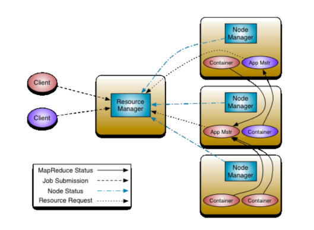
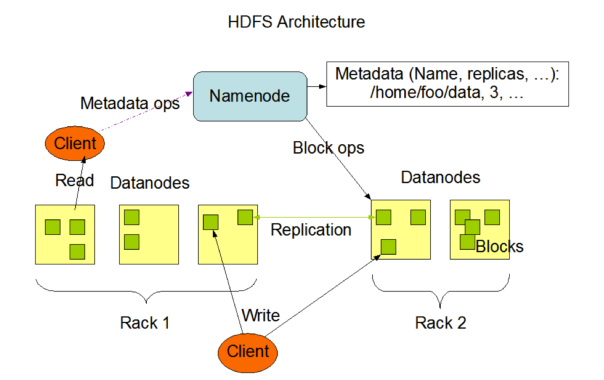
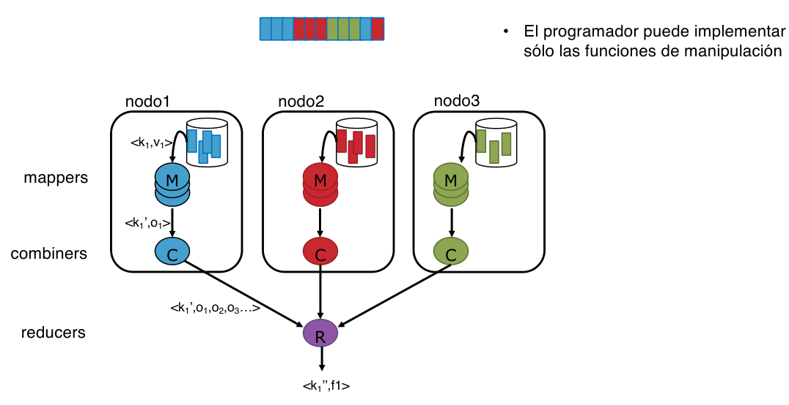
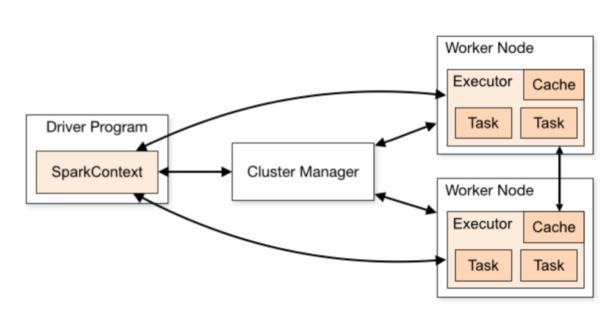

# T4 - Entorns AD
## Introducció
En entorns d'anàlisi de dades el focus deixa de ser en l'ús de la CPU. En comptes,és necessari centrar l'atenció en la velocitat de transmisió i accés de les dades i en la capacitat d'emmagamatze, ja sigui en disc o en memòria RAM.

Usualment el codi és molt paral·lelitzable, realitzant-se un seguit d'operacions simples sobre tot el conjunt. Gràcies a sistemes com Hadoop o Spark la manera com paral·lelitzar-ho es pot automatitzar i nosaltres, el programador podem centrar la nostra atenció en les operacions a realitzar. No obstant s'ha de tenir en compte la granularitat de les operacions, com particionar les dades per a fer-ho i la manera com escala.

### Paradigmes de computació
Tal com s'ha vist al llarg del grau en computació hi ha diversos **paradigmes**. El tradicional és el **centralized computing** on s'usa un sol sistema físic gestionat per un SO. 

És habitual, tal com vist a la primera part de l'assignatura, usar **parallel computing** on mitjançant els diversos threads d'un processador diversos processos s'executen simultàneament, compartint memòria i podent comunicar-se entre ells. 

En **distributed computing** hi ha un conjunt d'ordinadors independents que es comuniquen a través de missatges.

En **cloud computing** hi ha un conjunt de recursos disponibles a través d'internet que poden estar construits sobre recursos físics o virtuals.

### Tipus de sistemes

Aquests sistemes, poden ser **compute clusters** formats per un conjunt d'ordenadors interconnectats que col·laboren per a treballar com un *recurs únic*. Cada ordinador té el seu propi SO i una capa adicional com MPI permet la interacció entre diferent nodes. És el paradigma tradicional de HPC.
Altrament poden ser sistemes **peer-to-peer** format per un conjunt d'ordinadors interconnectats on cadascun actua alhora de client i servidor, no hi ha el concepte *master-slave*.
També existeixen els **internet clouds** que són una plataforma virtualitzada amb recursos assignats dinàmicament sota demanda.

### Models de Programació

En entorns de distributed computing és habitual usar *MPI* i per treballar amb dades és més habitual usar sistemes **Map-Reduce** on un mateix càlcul (map) es realitza sobre totes les dades i els resultats parcials es combinen amb *reduce*.

### Reptes
Els reptes en entors d'AD és l'escal·labilitat horitzontal; +hardware ha de implicar més rendiment. Ha d'haver-hi tol·lerància errors, ja que en sistemes distribuits hi ha molts factors en joc, i alta disponibilitat que és depen del temps sense fallos i el temps que tarda a recuperar-se.


A més es vol simplificitat d'us i poder usar només els recursos necessaris.

## Cloud Computing
Anomenem **cloud** al conjunt de serveis de computació oferts com a serveis i assignats dinàmicament, ja siguin hardware o software.Ens permeten contractar la quantitat exacta de serveix necessària durant el temps en que és necessari i adaptar-se dinàmicament a les necessitats/demanda. Els clouds poden ser **privats** o **publics** depenent si són d'us exclusiu d'una entitat o un servei ofert per una empresa a usuaris externs. També n'hi ha d'híbrids.

L'arquitectura del cloud es basa en **nodes**. Hi ha **nodes de control** uqe monitoritzen, creen clusters virtuals per els usuaris i són la porta d'entrada. Per altra banda els **nodes de càlcul** són els que fan la feina.

Aquests nodes es troben en **data centers** que estan formats per una rgan quantitat de servidors interconnectats i organitzats jeràrquicament amb discs locals i xarxes d'alta velocitat.

El **model de cost** del cloud es basa en el fet que no és necessari realitzar la inversió inicial en *infraestructura* i que el servei es pot anar adaptant a les necessitars que es tenen.

En el cloud s'ofereixen diferents serveis:
- En infraestructure as a service (**IaaS**) es solicita una quantitat de recursos de hardware i el client s'encarrega de la resta. Exemples són AWS EC2 i SR. 
- També s'ofereixen sistemes de Platform as a Service **PaaS** on es solicita el hardware juntament amb el software necessari i el client ha d'instal·lar i executar les aplicacions seves. Exemples són Google Cloud o Azure.
- En Software as a Service **SaaS** el client pot utilitzar aplicacions que el cloud ofereix sense tenir control de la infraestructura. Exemples són Google Docs, Gmail,etc.
- En Artifical intelligence as a Service **IAaaS** s'ofereixen aplicacions d'AI. Exemples són SageMaker, Azure ML, Cloud Machine Learning, etc.

## Virtualització
La virtualització permet executar diverses maquines virtuals sobre el mateix hardware. Ens dona la il·lusió de múltiples sistemes dedicats, aïlla els programes de l'entorn. Es poden crear fàcilment amb poc overhead i faciliten la portabilitat de programes i l'assignació de recursos a gra fi. També faciliten la gestió d'errors i milloren la tolerància a errors.

Hi ha diferents tipus:
- **Emulació**: es mimetitza el conjunt d'instruccions d'una màquina (p.ex BOchs).
- **A nivell de Hardware**:Permet crear una abstracció completa del sistema (HW+SW) de tal manera que el sistema *guest* s'executa de manera aillada sobre el *host*. Exemples són VirtualBox,VMWare,etc. Per a què funcionin és necessari una capa de software com hypervisor o VirtualMachine Monitor que multiplexa l'us dels recurs per donar la il·lusió que n'hi ha prous i emular el comportament del hardware. Pot ser:
  - **Completa:** el hypeervisor simula completament el underlying hardware i per tant el guest OS pot se run OS qualsevol no modificat, ja que aquest no és conscient que està sent virtualitzat. S'usa una combinació de execució directa i traducció de binaris. 
  - **Para-Virtualització**: el hypervisor no simula el hardware sinó que posa a disposició hypercalls. El guest OS usa les hypercalls per a executar les instruccions de CPU sensitives. Per tant el guest OS ha d'estar modificat i sap que està sent virtualitzat. Té més bon rendiment que la completa i permet al guest OS comunicar-se amb el hypervisor.
  - **Hardware-assisted** el underlying hardware ofereix instruccions especials de CPU per a virtualització. És el que donen Intel-VT i AMD-V.
Com a desavantatge la seva inicialització és lenta 

- **A nivell OS**: es basa en replicar l'espai a nivell d'usuari compartit un mateix SO a partir de **containers** (p.ex docker,singularity). Cada container té la ilusió de ser una màquina virtual gràcies al particionat del namespace i aïllant que pot veure cada container. Té com a punt fort el mínim overhead i cost de iniciar i l'alta escalibilitat. El desavantatge és que no es pot executar un SO diferent al del host.
- **A nivell aplicació**: independentitza les aplicacions de la màquina física i el SO (p.ex Java Virtual Machine).

### Clusters
Els clusters virtuals es construeixen mitjançant màquines virtuals que poden estar executades en un o més clusters físics. Es poden tenir diverses VM amb SO diferents sobre elm ateix host i podem canviar dinàmicament la miad del cluster. A més, un fallo físic del hos tno afecta a tot el cluster (només a les VM que s'executen en ell) i el fallo de una vm no afecta a la resta ni al host. Es pot usar per a execució distribuida de programes, tolerància a errors, etc i per implementar compartició de recursos, escalabilitat, etc.


# T5
Volem prioritzar escalabilitat i tolerància a errors per sobre del rendiment. Per a fer-ho existeixen diverses arquitectures:
- **Client-servidor** (master slave) que pot ser *thin-client* o fat-client*.
- **Peer to peer**
  
Amb aquest objectiu es creen models de prgoramació guiats per les dades que tenen com objectiu aplicar una mateixa funció sobre un gran conjunt de dades. Es basen en particionar les dades i executar de manera concurrent la mateixa funció a cada partició. Es prioritza l'escalabilitat horitzontal i la tolerància a errors per sobre del rendiment.

Per a fer-ho existeixen models de programació de computació guiada per dades com són Apache Haddop i Spark. Aquests models es basen en el model MapReduce.

## MapReduce
Pensat per a fer els mateixos càlculs sobre grups independents de dades. Primerament s'aplica un *map* en que les dades es filtren, ordenen o modifiquen seguit d'un *reduce* que agrega les dades. Ambdues estapes estan definides per a tuples`(key,value)`.
- **Map:** Aplica una funció $Map(k1,v1)\mapsto List(k2,v2)$. Que s'aplica a cada tuple key value de les dades. El domini d'entrada i sortida poden ser diferents.
- **Reduce:** és opcional. Agrega els resultats generats pel map. $Reduce(k2,List(v2))\mapsto List((k3,v3))$ L'entrada és valors que tenen la mateixa clau. Típicament produeix només un parell clau valor.

El framework MapReduce realitza les operacions de forma distribuida usant un conjunt de nodes. Ha d'implmenentar la partició de les dades, la gestió i execució del paralelelisme i la integració amb l'emmagamatze de dades. Està pnsat per executar-se en clusters i datacenters.

 Primerament cada worker aplica el map a un conjunt de dades locals, després es realitza un *shuffle* per a redistribuir les dades basat en els output keys i finalment es realitza el reduce.


### WordCount
Cada document es divideix en words, cada word es transforma en una tupla (word,1) i es realitza un reduce per a sumar els valors de cada tupla amb la mateixa clau (mateix word).
```
function map(String name, String document):
    for each word w in document:
        emit(w,1)
function reduce(String word, Iterator partialCounts):
    sum = 0
    for each pc in partialCounts:
        sum += pc
    emit (word,sum)
```

### Pros i Contres
No necessàriament són la implementació més rpaìda però permeten haver de només escriure el Map i el Reduce. Hi ha un tradeoff entre cost computacional i cost de comunicació. 
Per a conjunts petits de dades i tasques senzilles normalment no és efectiu usar MapReduce ja que el overhead no compensa.
Són frameworks dissenyats amb la robustesa en ment; realitzant backups de les dades en diferents nodes.


## Apache Hadoop
És un MapReduce framework de codi obert basat en java i inspirat per Google. És escalable, resilient, d'alta availability i explota la localitat de les dades. 
Pot executar-se en commodity hardware i executar sistemes HDFS.

Té 4 parts fonamentals; **Hadoop common**, **HDSFS**, **MapReduce**, el **YARN**. El map reduce es basa en YARM i té el resource manager (master) i Node managers (slaves). El Node manager crea els containers de les aplicacions sota de manda del resource manager. Hi ha també el MRAppMaster que s'executa en un containe ri comprove l'estat de les tasques, reiniciant les que fallen.
L'arquitectura ideal és nodes amb discs locals que fan tant tasques de càlcul com gestió de les dades. D'aquesta manera els càlculs d'una partició es fan al mateix node on s'emmagametzen.


### HDFS
El Hadoop distributed file system s'encarrega de particionar i repartir les dades al cluster. Ofereix la visió d'un sol disc centralitzat quan realment la informació està repartida en nodes. Té la filosofiía de s'escriu un sol cop i es llegeix tantes com es vulgui per a facilitar la gestio de coherencia.

Per a tenir tolerància a fallos usa replicació (normalment 3 còpies de les dades) o erasure coding. Aquest últim és més eficient a nivell d'emmagatzematge però més costos computacionalment.

Típicament un cluster està format per un **NameNode** que és el punt d'accés al cluster i l'encarregat del bookkeeping de les dades, implementar el namespace i assignar blocks als datanodes i de fer balanceig. El secondari està al dia del NameNode i actua com a backup preparat per entrar en acció, està en *standby*. Els **DataNodes** és on es guarden les dades i s'executen les tasques computacionals. Són data i worker nodes alhora normalment.



Per a poder treballar amb fitxers grans HDFS divideix les dades en blocs de igual mida preconfigurada (excepte el últim) que es reparteixen entre els nodes. Normalment 128MB i 3 rèpliques. El NameNode intenta prioritzar localitat de les dades.

HDFS es basa en el principi de *Write Once Read Many* **WORM**. Per a simplificar la coherència de les dades i augmentar el throughtput un cop un fitxer és creat o modificat no es pot modificar el que s'ha fet (però si afegir cosa al final). Només pot haver-hi un escriptor alhora. 

Per a augmentar la tolerància a aerrors hi ha multiples namenodes en standyby.

### MapReduce
Les fases el MapReduce job són:
- **split:** es particiona les dades i es repeteix pels nodes amb el InputFormat.
- **map:** aplicar la funció de map a cada bloc *map task*
- **sort&shuffle:** el output dels mappers s'ordena i distribueix als reductors
- **reduce:** s'aplica la funció de reducció i es produeix un output

El split, sorting i shuffling els fa el framework i l'usuai ha d'implementar només el map i el reduce. Notem que el map i el reduce es poden fer en paral·lel a cada node ja que són independents. EL split no és el mateix que la repartició de les dades en blocs, el split depen de les keys, el map, etc.

A nivell d'implementació, les classes de key i value han d'implentar `Writable` i `WritableComparable` respectivament.




### Detalls de l'API

- Entrada de dades: ha d'implementar `getSplits` per a particionar l'entrada en `InputSplits`, que és la unitat de treball del mapper i també `createRecordReader` que és la instància d'una classe que donat un inputsplit obté un record (unitat de treball ed map). La classe per defecte és `TextInputFormat` i la configuració del job decideix la mida de cada InputSplit. Normalment el record és una linea on la key és la pisició dins del fitxer i el value el contingut de la linia.
- Operacions sobre les dades:
  - map: rep un conjunt de tuples `<key,value>` i produeix com a sortida un altre conjunt `<key,value>` que poden ser de tipus/valor diferent. Es llança un mapper per cada InputSplit.
  - combiner: funció opcional per agrupar valors de sortida amb la misma key dels mappers locals. Té sortida `<key,list(value)>`.
  - reducer: el resultat del map o combiner és ordenat i particionat per enviar als reducer. El nombre no depen de les dades sinó que és un paràmetre dehadoop. 

- Sortida de les dades: ha d'implementar `getRecordWriter`. Per defecte és TextOutputformat.

### Word Count
Usa les classes default. L'entrada és un fitxer de text, cada InputSplit un conjunt de linies i cada record 1 linia. 
- mapper: entrada `<nºlinea,text linea>`i sortida `<word,1>`.
- combiner: entrada `<paraula,list(nº ocurrencies)>` i sortida `<paraula, suma ocurrències>`.
- reducer: entrada `<paraula,list(nº ocurrencies)>` i sortida `<paraula, suma ocurrències>`.
###MIllores
Es pot implementar una classe propia de dades i així es pot tunejar més tot. Es pot configurar el número de maps, redeucers,etc.


## Apache Spark

És una implementació de MapReduce que intenta oferir un millor rendiment que Hadoop. Entre d'altres evita escritpures intermitges a disc, usa caches, etc. Té els mateixos objectius que hadoop i ofereix una gestió transparent del paralelisme i apis en diferents llenguatges.

### Arquitectura
És del tipus **master-slave**:
- **Driver**: és el master. Analitza el codi i demana els recursos necessaris i planifica i monitoritza les tasques.
- **Executors:** són els slaves que executen les tasques.
- **Cluster-manager** assignal es recursos i crea els procesos executors als nodes slave. Hi ha 3 tipus de gestió de clusters; standalone, hadoop YARN i cubernetes.
  
Quan varis eplicacions s'executen alhora s'ha de repartir els recursos. En clusters sntandaloene per defecte una aplicació consumeix tots els recursos i fins que no acaba no passa a la següent. Això pot canviarse. 

Cada aplicació té el seu propi executor process i per tant les aplicaciojns es troben aïllades entre si, no es poden compartir dades entre aplicacions. Cada aplicació es correspon a un **SparkContext** que es corra al driver prorgam (el master).

### Components
- Spark Core: part central encarregada del processat; gestió de memòria, recup d'errors, planiffiació, interacció amb emmagamatze,etc.
- Spark Streaming
- Spark SQL
- GRaphX
- MLlib
- SparkR
  
### Estructura de dades - RDD
Spark es basa en l'us de **Resilient Distributed Dataset RDD**. Són objectes de només lectura que són conjunts de records. Es troben distribuits als clusters i tenen rèpliques. Es particionen per a processar en paral·lel. Si no estan balancejats s'ha de fer implementació pròpia.
Es poden transformar en altres RDD mitjançant transofmration o en un resultat amb una action.
Els RDD es poden crear a partir de col$Leccions de memòria, dades de disc, a partir de un altree RDD,etc. 

Com veuerem més endavant també hi ha dataframes i datasets pensats per a dades estructurades.

### Estructura d'un prorgama
Es crea un SparkContext i es tria el RDD que farà d'input. S'iopera sobre les particions del RDD usant lazy evaluation. Només es fa càlculs quan hi ha una acció.

Les particions del RDD determinen el nº de tasks **(1 task per partició)**

Tenim::
- **Transformations**: càlcul sobre un RDD que genera un altre RDD. Poden ser **Narrow** o  **Wide** depenent si totes les dades necessaries estan o no a la mateixa partició.
- **Actions:** generen un resultat que es guarda o mostra per pantalla. Donen per acabada una seq. de transformacions i provoquen que s'iniciin els calculs.
Per defecte cada vegada que s'executa una acció sobre un RDD es torna a calccular el RDD. Es pot evitar amb persist.

### Transformacions
- **map:** rep una funció per paràmetre i crea un RDD resultat d'eplicar la funció sobre cada record del RDD. `text_file.map(lambda line: line.lower)`
- **flatMap**: igual que el Map però per cada element poden haver 0 o més resultats. `text_file.flatMap(lambda line: line.split(""))`
- **filter** rep una funció com a paràmetre i crea un nou RDD amb els elements del RDD que compleixen la condició.
- **reduceByKey** rep una funció que ha de ser comm i associativa. L'entrada és parelles key value i agrupa per key i aplica la fucnió als valors.
- **aggregateByKey** rep un valor inicial i una fucnió de reducció local i una de reducció entre nodes. Donat parelles key vallue ????
- **sortByKey**
### Accions
- **collect** retorna el RDD al driver
- **count**
- **take**
- **takeOrdered**
- **reduce**
- **saveAsTextFile**

### WordCount
``
from pyspark import context
sc = SparkContext("local","Nombre")
text_file=sc.textFile("hdfs://...")
counts = text_file.flatMap(lambda line: line.splot("")).map(lambfa word: (word,1)).reduceByKey(lambda a,b:a+b)
counts.saveAsTextFile("hdfs://...")
``

### DAG: tasks i etapes
El driver crea un grap que representa el processat (logical execution plan) amb les dependències entre RDD. Quan el driver trobauna acció envia el DAG al DAG scheduler que converteix el logical execution plan en un physical execution plan basat en etapes. Les etapes són transfo que es poden resoldre de manera local intentant usar només memòries. Le stages s'envien al task schedulr.


### SparkSQL
Es basa en estructures de dades DataFrame i Dataset. Són com taules i es poden crear apartir de bd, fitxers estructurats,etc.

ACABAR

### Strucutres Streaming
Permet l'entrada de dades en temps real sobre SparkSQL. Es reben les dades i s'agrupen en dataframes. 

### MLIB
Algorismes de ML en spark sobre sparksqll.

# Cassandra
És una base de dades escalable, eventualment consistent i distribuida d'estructures `key-value`. És de codi obert i actualment està gestionada per Apache.
## Sobre NoSQL
FALTA PER FER

## Arquitectura
Usa una arquitectura **peer-to-peer** de tal manera que tots els nodes intercanvien informació entre ells de manera continua. No hi ha nodes principals i els clients poden accedir a la DB desde des de qualsevol node. El node al qual el client es connecta actua com a **coordinador** entre aquest i la resta de nodes i determina quins nodes han de respondre a les consultes.

Un cluster conté un conjunt de nodes (virtuals o físics) que són el component bàsic de Cassandra i on es guarden les dades.

 
